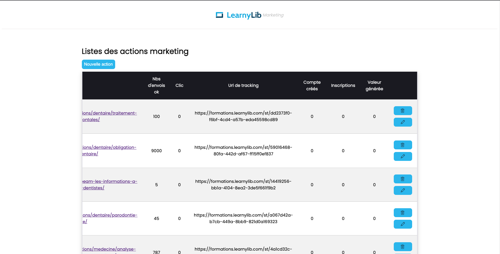
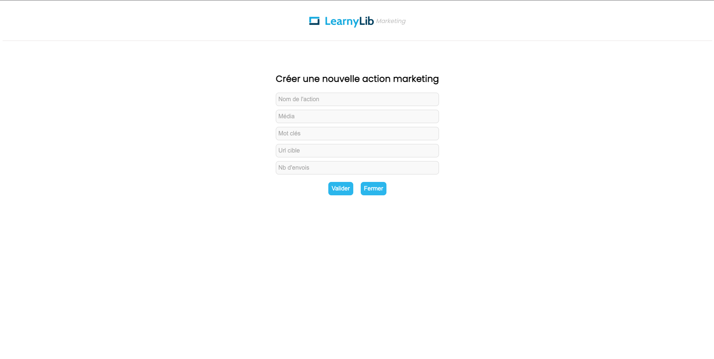

# Interface Marketing learnylib

L'objectif de cette application est de mettre à disposition du pôle marketing une interface afin de créer et de suivre des actions.

The objective of this application is to provide the marketing department with an interface to create and track actions.

# Résultat 

Info : Ce projet contient des données relatif à la stratégie marketing de learnylib est ne doit en aucun cas se retrouver en mode "public" sur un repo. 

## L'authentification est gérée via le service firebase.

## Structure de l'application 

Adresse fake api server pour tester mes données : http://localhost:3006/actions